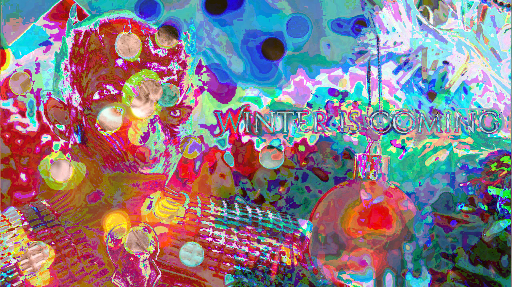
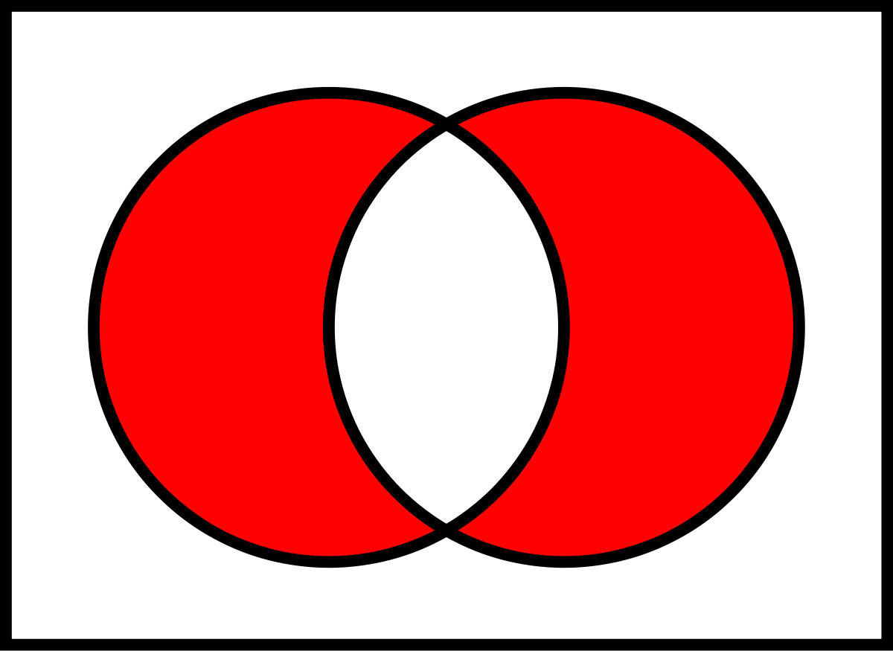

# Exclusive Santa

Dear Santa,

Hey! There are so many toys that I want, but I just don't have the money. I don't care which toy I get as long as it's one or the other, but not both!

- CTFlearn

In this challenge, we are given two images:





It is obvious that the first image looks distorted. After trying to binwalk both images, we can find something interesting in the second image.

```bash
$ binwalk 3.png 

DECIMAL       HEXADECIMAL     DESCRIPTION
--------------------------------------------------------------------------------
0             0x0             PNG image, 1200 x 875, 8-bit/color RGBA, non-interlaced
78            0x4E            Zlib compressed data, default compression
52406         0xCCB6          PNG image, 1280 x 720, 8-bit/color RGBA, non-interlaced
52447         0xCCDF          Zlib compressed data, compressed
```

We see there is an image hidden in the second image. We can extract it with binwalk,

```bash
$ binwalk -D 'png image:png' 3.png 

DECIMAL       HEXADECIMAL     DESCRIPTION
--------------------------------------------------------------------------------
0             0x0             PNG image, 1200 x 875, 8-bit/color RGBA, non-interlaced
78            0x4E            Zlib compressed data, default compression
52406         0xCCB6          PNG image, 1280 x 720, 8-bit/color RGBA, non-interlaced
52447         0xCCDF          Zlib compressed data, compressed
```

Then, we would get a folder called `_3.png.extracted/` in which there is an image called `CCB6.png`. If we open it, we will see the original image of the night king.

Combine this image with the distorted night king image (xor) and horizontally flip it, we can see the following image:


Hence, the flag is `CTFlearn{Santa_1s_C0ming}`
