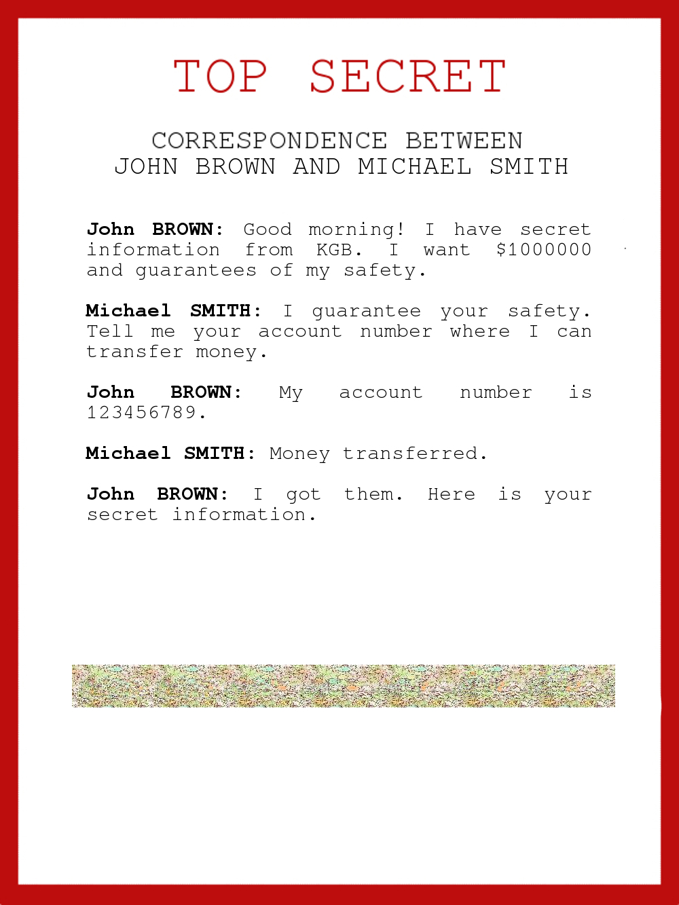
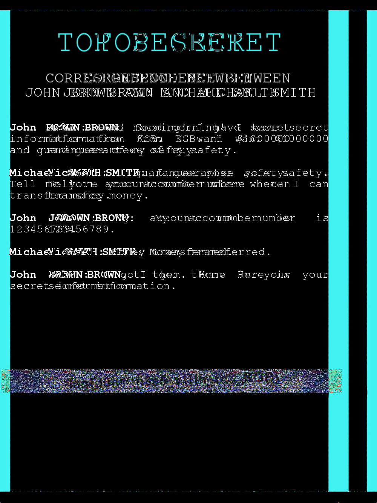

# The adventures of Boris Ivanov. Part 1.

The KGB agent Boris Ivanov got information about an attempt to sell classified data. He quickly reacted and intercepted the correspondence. Help Boris understand what exactly they were trying to sell. Here is the interception data: `https://mega.nz/#!HfAHmKQb!zg6EPqfwes1bBDCjx7-ZFR_0O0-GtGg2Mrn56l5LCkE`

The image is as follows:

Seeing the messed up block of image, we intuitively know that we can try stereosolver of stegsolve.

With an offset of 102, we can see the following image:

Hence, the flag is `flag{d0nt_m3s5_w1th_th3_KGB}`
